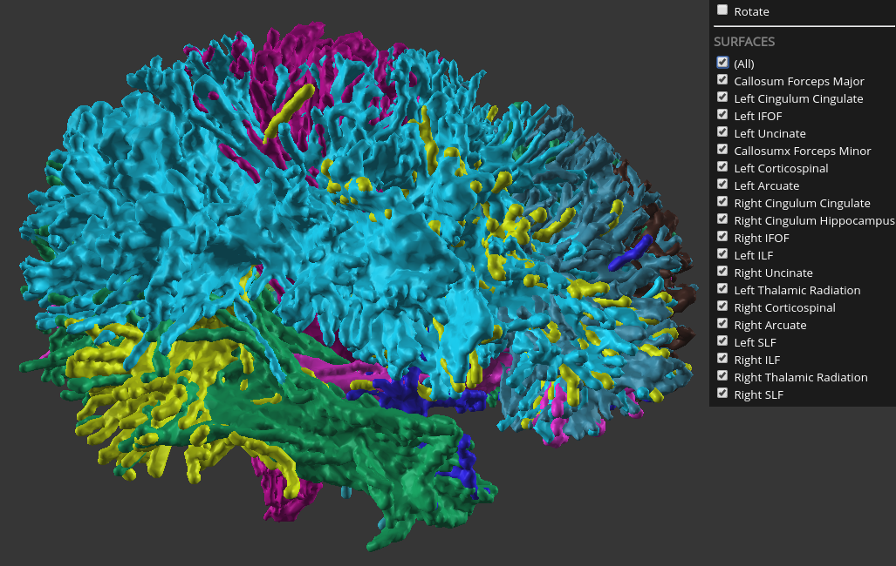

# ui-3dsurfaces 

This app takes a configured list of URLs for VTK files and renderes it using WebGL. This app is used by Brainlife to show `neuro/3dsurfaces` datasets.

Take a look at this [demo](https://brainlife.io/ui/surfaces/)

### Authors
- Soichi Hayashi (hayashis@iu.edu)

### Contributors
- Steven O'Riley (stevengeeky@gmail.com)

### Project Director
- Franco Pestilli (franpest@indiana.edu)

### Funding 

### References 
TBA

## Running the App 

### On Brainlife.io

UPDATE.

### Running Locally (on your machine)

UPDATE

### Sample Datasets

UPDATE

## Output

UPDATE.

#### Product.json

Not relevant for this App as it does not geenrate processed data. 

### Dependencies

This App only requires [singularity](https://www.sylabs.io/singularity/) to run. If you don't have singularity, you will need to install following dependencies.  

  - UPDATE: https://github.com/address
  

